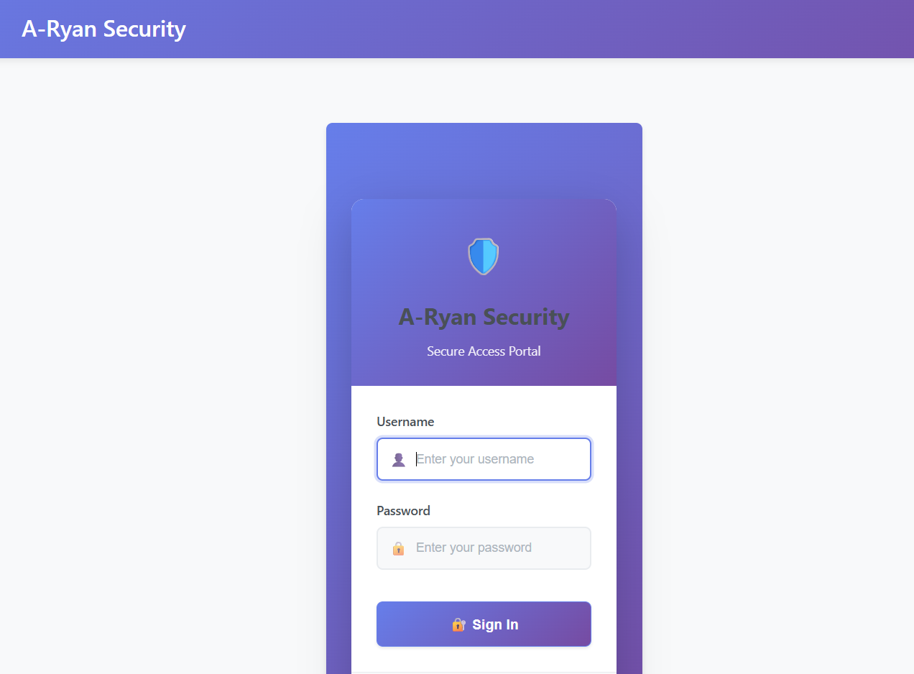
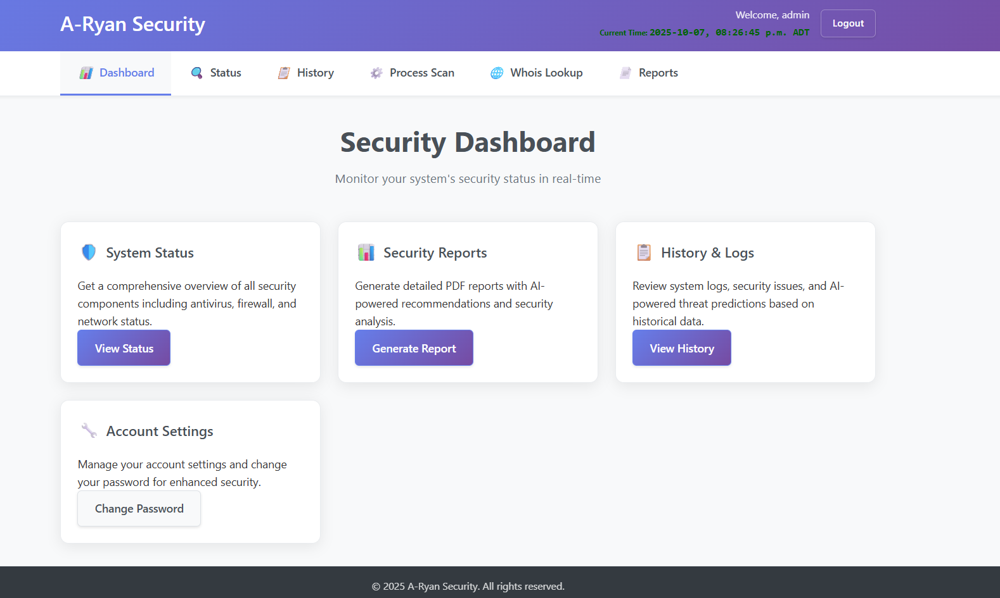
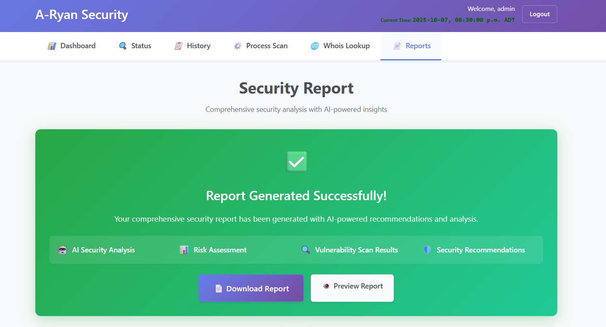

# A-Ryan-Security

A comprehensive cybersecurity monitoring and analysis platform built with Python that provides advanced threat detection, vulnerability assessment, and real-time security monitoring through an intuitive web-based dashboard.

## Overview

A-Ryan Security is a sophisticated security enhancement tool that extends beyond traditional antivirus protection by integrating multiple layers of security analysis including AI-powered threat detection, network anomaly detection, vulnerability scanning, and comprehensive system monitoring. The platform provides real-time insights and automated security recommendations to help users maintain a robust security posture.

## 







## Core Features A-Ryan-Security

### 🔒 **Advanced Security Scanning**
- **OSV-Scanner Integration**: Automated vulnerability scanning using Google's OSV database
- **Custom Directory Scanning**: User-selectable scan paths with configurable options
- **Comprehensive Vulnerability Assessment**: Detection of security issues in dependencies and packages
- **Scan History Tracking**: Complete audit trail of all security scans with detailed results

### 🛡️ **System Protection & Monitoring**
- **Enhanced Antivirus Layer**: Integration with Windows Defender for multi-layered protection
- **Real-time Process Monitoring**: Continuous analysis of running processes and system services
- **Startup Program Analysis**: Security assessment of system startup configurations
- **Firewall Status Monitoring**: Real-time firewall rule analysis and status reporting

### 🌐 **Network Security Analysis**
- **Network Traffic Analysis**: Machine learning-powered anomaly detection using PyTorch
- **Nmap Integration**: Comprehensive network scanning and service detection
- **Packet-level Analysis**: Deep packet inspection using Scapy for threat identification
- **Network Interface Monitoring**: Real-time network statistics and interface analysis

### 🤖 **AI-Powered Security Intelligence**
- **Threat Prediction**: Machine learning models for identifying suspicious network patterns
- **Automated Analysis**: AI-driven security recommendations and risk assessments
- **Ollama Integration**: Advanced AI analysis for comprehensive threat evaluation
- **Behavioral Analysis**: Intelligent detection of anomalous system behavior

### 📊 **Web-Based Dashboard**
- **Real-time Monitoring**: Live security status updates via WebSocket connections
- **Interactive Visualizations**: Charts and graphs for security metrics and trends
- **Historical Data Analysis**: Comprehensive logs and audit trails
- **Responsive Interface**: Bootstrap-powered responsive design for all devices

### 🔐 **Security Features**
- **Role-Based Access Control**: Multi-level user permissions and access management
- **Secure Authentication**: Flask-Login with bcrypt password hashing
- **Audit Logging**: Comprehensive tracking of all user actions and system events
- **Session Management**: Secure session handling with configurable timeouts
- **CSRF Protection**: Cross-site request forgery prevention
- **Rate Limiting**: Protection against brute force attacks

## Technical Architecture

### Backend Stack
- **Web Framework**: Flask with SocketIO for real-time communications
- **Database**: SQLite with SQLAlchemy ORM and migration support
- **Authentication**: Flask-Login with secure password policies
- **Caching**: Flask-Caching with Redis support for performance optimization
- **Task Scheduling**: APScheduler for background job management

### Security Components
- **Vulnerability Scanning**: OSV-Scanner for dependency analysis
- **Network Analysis**: Nmap and Scapy for comprehensive network assessment
- **System Monitoring**: psutil for real-time system metrics
- **AI/ML**: PyTorch for machine learning models, Ollama for AI analysis

### Frontend Stack
- **UI Framework**: Bootstrap for responsive, mobile-friendly interface
- **Real-time Updates**: SocketIO for live data streaming
- **Charts & Visualizations**: Interactive security metrics and reporting
- **Form Handling**: Flask-WTF with CSRF protection

## System Requirements

### Hardware Requirements
- **Operating System**: Windows 10/11 (64-bit)
- **RAM**: 8GB minimum, 16GB recommended
- **Storage**: 2GB free space for installation and logs
- **Network**: Active internet connection for updates and AI services

### Software Dependencies
- **Python**: 3.8 or higher
- **Administrator Privileges**: Required for full functionality
- **External Tools**:
  - Nmap (network scanning)
  - OSV-Scanner (vulnerability assessment)
  - Ollama (AI analysis)

## Installation Guide

### 1. Environment Setup
```bash
# Create virtual environment
python -m venv venv

# Activate virtual environment
# Windows:
venv\Scripts\activate

# Install Python dependencies
pip install -r requirements.txt
```

### 2. External Dependencies Installation

#### Install Nmap
1. Download from: https://nmap.org/download.html
2. Run the installer and select "Add to PATH" option
3. Restart your terminal/PowerShell

#### Install OSV-Scanner
https://github.com/google/osv-scanner/releases
```bash
# Download OSV-Scanner binary
# Place osv-scanner_windows_amd64.exe in project root
```

#### Install Ollama (for AI features)
```bash
# Install Ollama from https://ollama.com/download
ollama pull gemma3:4b
```

### 3. Database Initialization
```bash
# Initialize database with default admin user
python init_db.py
```

### 4. Configuration
Create a `.env` file or set environment variables:
```bash
# Required environment variables
SECRET_KEY=your-secret-key-here
FLASK_ENV=development
ADMIN_PASSWORD=your-secure-admin-password
```

## Usage Instructions

### Starting the Application
```bash
# Run as administrator for full functionality
python main.py
```

### Accessing the Interface
1. Open web browser and navigate to: `http://127.0.0.1:5000`
2. Login with default credentials:
   - **Username**: admin
   - **Password**: AdminPassword123! (change immediately)

### Initial Setup
1. **Change Default Password**: Navigate to change password section
2. **Configure Scan Paths**: Set preferred directories for vulnerability scanning
3. **Review Security Settings**: Check firewall and system configurations
4. **Run Initial Scans**: Perform comprehensive security assessment

## Security Features Configuration

### Password Policies
- Minimum 12 characters with complexity requirements
- 90-day expiration with forced change notifications
- Account lockout after 5 failed attempts
- Secure password reset mechanisms

### Access Control
- Role-based permissions (admin/user)
- Session timeout management
- IP-based access logging
- Comprehensive audit trails

### Network Security
- Real-time anomaly detection
- Network traffic monitoring
- Firewall rule analysis
- Port scanning protection

## Testing & Quality Assurance

### Running Test Suite
```bash
# Run all tests
pytest tests/ -v

# Run with coverage report
pytest tests/ --cov=. --cov-report=html

# Run specific test categories
pytest tests/test_vuln_checker.py -v
pytest tests/test_network_analyzer.py -v
```

### Test Coverage
- **55 comprehensive tests** covering all major components
- Unit tests for individual modules
- Integration tests for web interface
- Security and authentication testing
- Performance and load testing

## Project Structure

```
A-Ryan-Security/
├── main.py                    # Application entry point
├── config.py                  # Configuration management
├── models.py                  # Database models and schemas
├── requirements.txt           # Python dependencies
├── antivirus.py              # Windows Defender integration
├── firewall.py               # Firewall management
├── vuln_checker.py           # OSV-Scanner integration
├── network_analyzer.py       # Network analysis & ML
├── ai_integration.py         # AI-powered analysis
├── process_scanner.py        # System process monitoring
├── reports.py                # PDF report generation
├── services.py               # Core business logic
├── web_interface/            # Flask web application
│   ├── app.py               # Main Flask application
│   ├── templates/           # HTML templates
│   ├── static/              # CSS, JS, and assets
│   └── performance_optimizer.py
├── tests/                   # Comprehensive test suite
├── db/                      # Database files
```

## Performance Optimization

### Caching Strategy
- **Flask-Caching**: In-memory and Redis caching
- **Query Optimization**: Database query performance monitoring
- **Background Tasks**: APScheduler for non-blocking operations
- **Real-time Updates**: WebSocket for live data streaming

### Monitoring & Analytics
- **Performance Metrics**: Request timing and resource usage
- **Error Tracking**: Comprehensive error logging and reporting
- **System Health**: Real-time system status monitoring
- **Audit Trails**: Complete action and event logging

## Security Considerations

### Production Deployment
- **HTTPS Only**: SSL/TLS encryption required
- **Environment Variables**: No hardcoded secrets
- **Firewall Configuration**: Proper network security rules
- **Regular Updates**: Keep dependencies current
- **Backup Strategy**: Regular database and configuration backups

### Compliance & Best Practices
- **OWASP Guidelines**: Following security best practices
- **Data Protection**: Secure handling of sensitive information
- **Access Controls**: Principle of least privilege
- **Audit Requirements**: Comprehensive logging for compliance

## Troubleshooting

### Common Issues
- **Permission Errors**: Run as administrator
- **Port Conflicts**: Ensure port 5000 is available
- **Database Issues**: Check database file permissions
- **AI Service Errors**: Verify Ollama installation and model availability

### Debug Mode
Enable debug logging by setting:
```bash
export FLASK_ENV=development
export DEBUG=true
```

## Contributing

### Development Guidelines
1. Follow PEP 8 coding standards
2. Write comprehensive tests for new features
3. Update documentation for any changes
4. Use meaningful commit messages
5. Ensure all tests pass before submitting

### Feature Requests
- Open issues for bug reports and feature requests
- Provide detailed descriptions and use cases
- Include relevant logs and error messages

## License

This project is licensed under the MIT License. See the LICENSE file for details.

## Support

For technical support, feature requests, or bug reports:
1. Check existing issues in the repository
2. Review troubleshooting documentation
3. Provide detailed system information and logs
4. Include steps to reproduce any issues

---

**A-Ryan-Security** - Advanced Security Monitoring & Analysis Platform
*Built with Python, Flask, and modern security practices*
